<div align="center">

# 🎭 TICKETING_SEM7

### Taller Semana 7 — Sistema de Venta de Entradas para Artes Escénicas

**Equipo del Proyecto:**  
Christopher Ismael Pallo Arias — **QA**  
Luis Alfredo Pinzón Quintero — **DEV**

**Proyecto:** Ticketing MVP — Microservicios Java + React SPA + API Gateway + Mensajería Asíncrona  
**Objetivo:** Construir e integrar las piezas críticas de un sistema de venta de entradas funcional: reservas temporizadas de 10 minutos, pago simulado con liberación asíncrona de entradas no pagadas, notificaciones en tiempo real y panel de administración completo sobre una arquitectura de microservicios distribuida y containerizada.

<br />

### 🛠️ Stack Tecnológico

**Microservicios · API Gateway · SPA React · Mensajería Asíncrona · Containerización**
<br />


</div>

---

## 🎭 Sobre el Producto (Contexto de Negocio)

**Sistema de Venta de Entradas para Obras de Teatro**  
El sistema resuelve el problema histórico del inventario bloqueado: cuando un comprador intenta adquirir una entrada pero no completa el pago, el sistema tradicional congela la venta indefinidamente, privando a otros compradores de ese cupo.

Nuestro MVP orquesta un **temporizador ágil de 10 minutos** respaldado por jobs `@Scheduled`, validaciones optimistas de inventario (`@Version` en `Reservation`) y liberación asíncrona vía **RabbitMQ con Outbox Pattern**. Si el pago falla o el tiempo expira, las entradas se liberan automáticamente garantizando **cero sobreventas**.

Para el espectador significa transparencia y disponibilidad real de entradas. Para el organizador, maximización de ingresos y control total del aforo por sala.

**Funcionalidades construidas en este MVP:**
- Configuración de aforos estrictos por sala y validación de topes de capacidad.
- Estructuración dinámica de categorías (**Tiers**): *General, VIP y Early Bird* (temporal, con fecha de vencimiento).
- Reserva con cuenta regresiva de 10 minutos y máximo 3 intentos de pago.
- Simulador de transacciones: `APPROVED` o `DECLINED`.
- Liberación asíncrona de entradas abandonadas vía scheduler + RabbitMQ.
- Notificaciones in-app: pago exitoso, pago fallido, entrada expirada, evento cancelado.
- Mapa de asientos visual por tier (`SeatMap`).
- Panel de Administración con estadísticas consolidadas en tiempo real.
- Autenticación JWT para dos roles: `ADMIN` y `BUYER` (incluyendo checkout como guest).

---

## 📚 Glosario Transversal

| Término | Definición |
|---------|-----------|
| **Evento** (`event`) | Obra de teatro publicada para venta de entradas |
| **Aforo** (`capacity`) | Cantidad total de entradas disponibles por Evento |
| **Tier** (`tier`) | Nivel de precio: `GENERAL`, `VIP`, `EARLY_BIRD` |
| **Reserva** (`reservation`) | Bloqueo temporal de una entrada (TTL 10 min) mientras el comprador completa el pago |
| **Ticket** (`ticket`) | Comprobante confirmado tras pago exitoso. Descargable en PDF |
| **Timeout** | Vencimiento automático de la reserva cuando el comprador no paga a tiempo |
| **Scheduler** | Proceso `@Scheduled` que corre en segundo plano revisando y expirando reservas vencidas |
| **Outbox Pattern** | Patrón de consistencia: se escribe en tabla `outbox_event` dentro de la misma transacción DB; un job lo publica asincrónamente a RabbitMQ |
| **Bloqueo Optimista** | Campo `@Version` en `Reservation` que evita race conditions: solo un comprador puede reservar la misma entrada simultáneamente |
| **Pago Simulado** (`mock payment`) | Resultado de autorización controlado: `APPROVED` o `DECLINED` |
| **X-Role / X-User-Id** | Headers inyectados por el API Gateway tras validar el JWT. Los microservicios confían en ellos; los clientes no pueden falsificarlos |
| **X-Service-Auth** | Header secreto para autenticación inter-microservicio (ms-ticketing → ms-events) |

---

## 🔀 Flujo Operativo del MVP

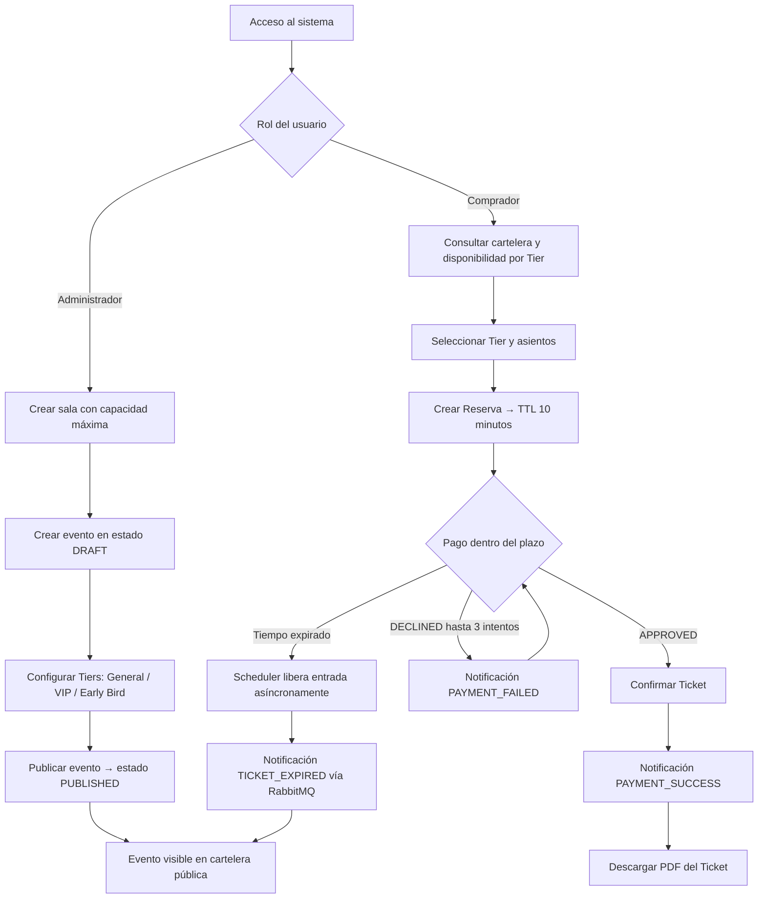

---

## 🚀 Arquitectura Real Construida

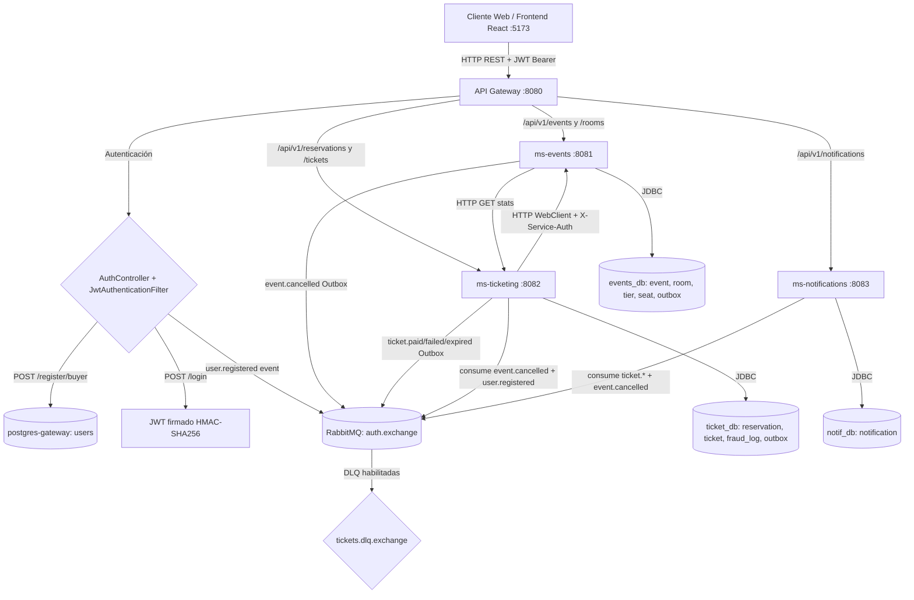

---

## 🌌 Diagramas C4 — Arquitectura de Software

> Modelo C4 (Simon Brown): **Contexto → Contenedores → Componentes → Código**.  
> Generados a partir de la [auditoría de arquitectura completa](./docs/c4-audit-matrix.md).

---

### 📍 Nivel 1 — Contexto del Sistema

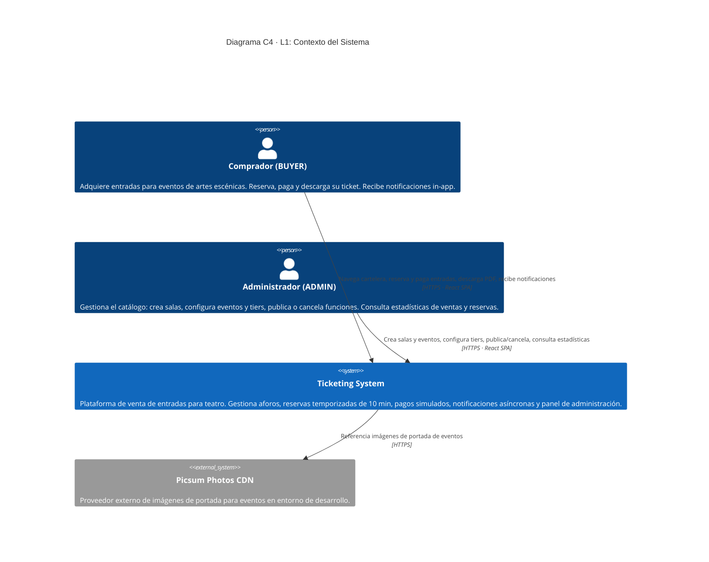

---

### 📍 Nivel 2 — Contenedores

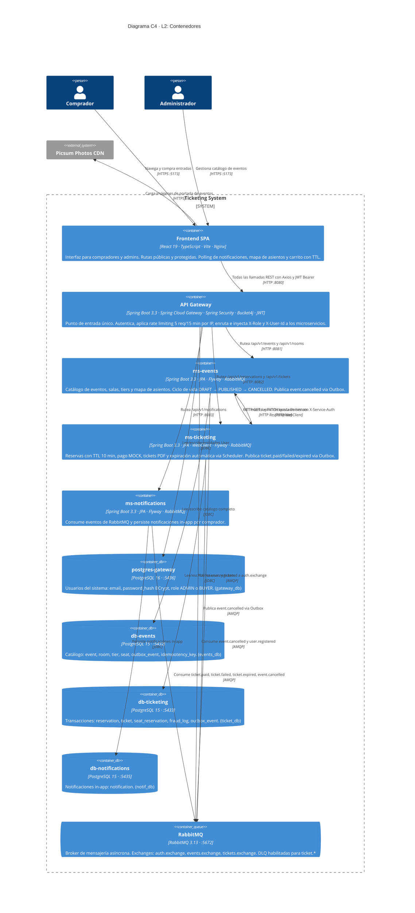

---

### 📍 Nivel 3 — Componentes: API Gateway

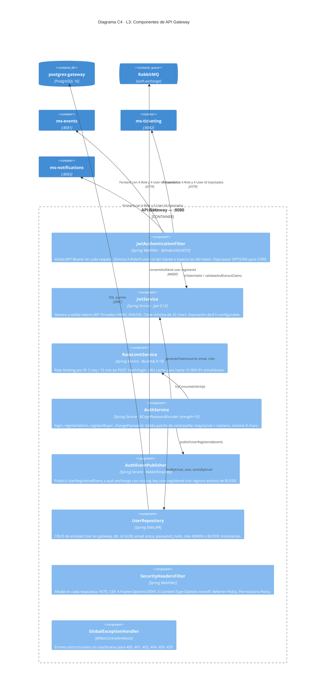

---

### 📍 Nivel 3 — Componentes: ms-events

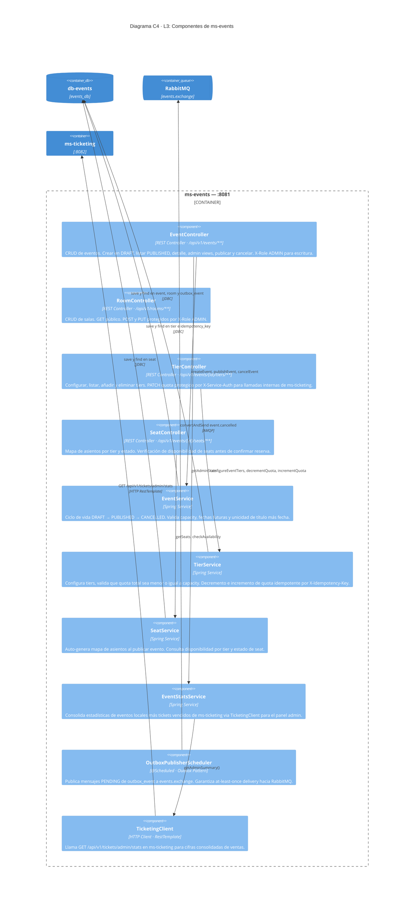

---

### 📍 Nivel 3 — Componentes: ms-ticketing

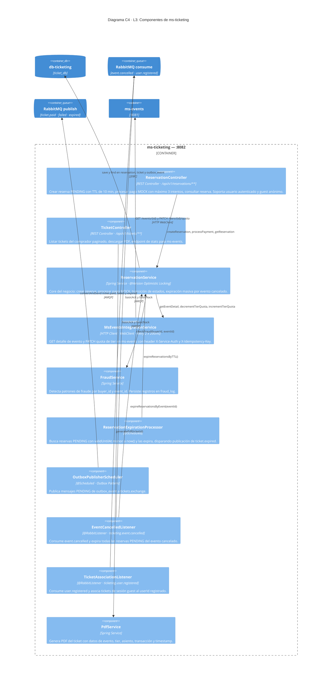

---

### 📍 Nivel 3 — Componentes: ms-notifications

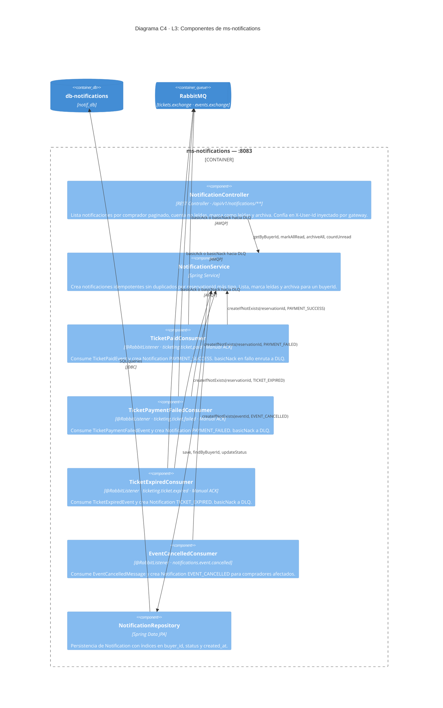

---

### 📍 Nivel 3 — Componentes: Frontend SPA

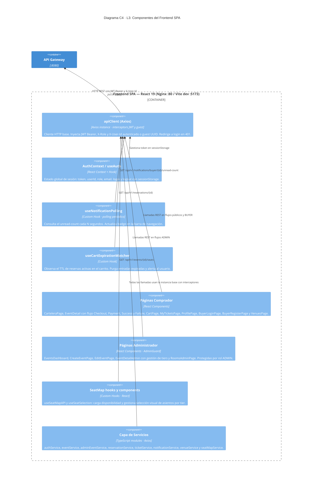

---

### 📍 Nivel 4 — Modelo de Datos por Bounded Context

#### gateway_db · notif_db

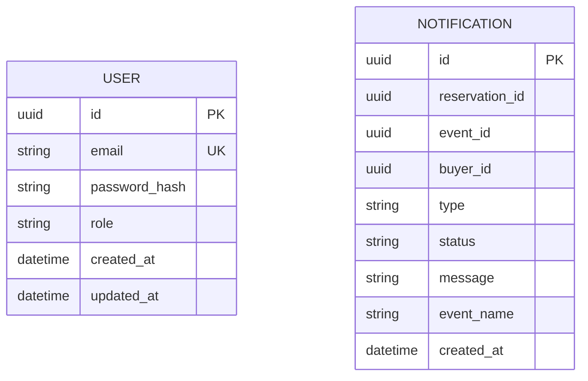

#### events_db

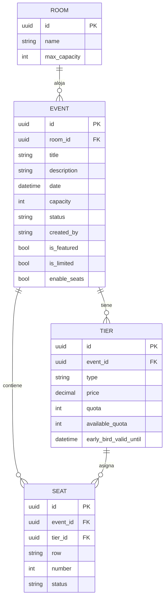

#### ticket_db

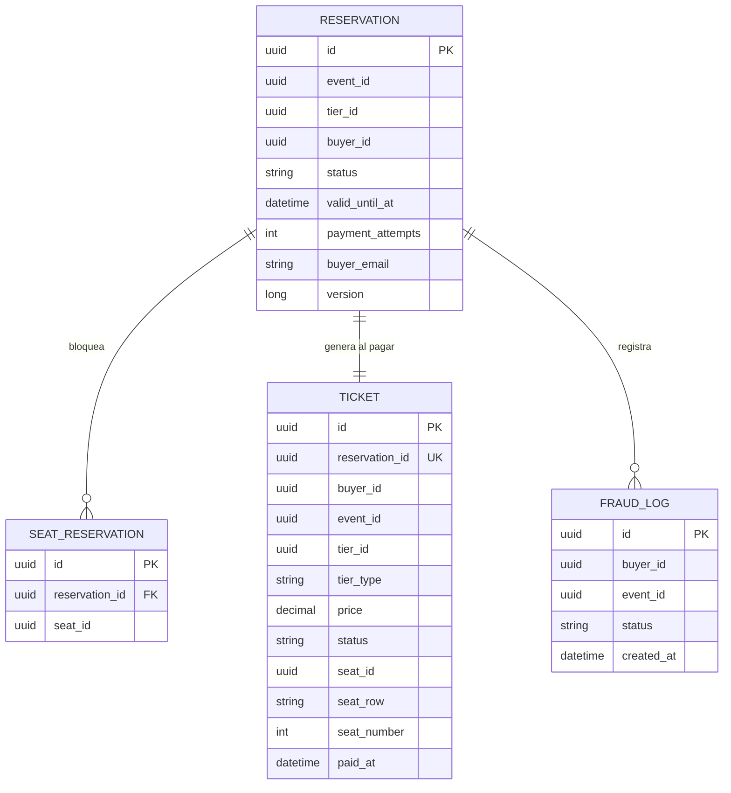

---

## 🌌 Ecosistema de Repositorios

El proyecto sigue una estrategia de separación de responsabilidades con repositorios satélite dedicados a la validación automatizada:

| Perfil / Dominio | Repositorio | Evidencia en Vivo |
|---|---|---|
| 🏗️ **Backend + Frontend (esta app)** | [🔗 **TICKETING_SEM7**](https://github.com/ChristopherPalloArias/TICKETING_SEM7) | *Microservicios, API Gateway, React SPA* |
| 🥋 **Certificación Funcional API** | [🔗 **TICKETING_SEM7_KARATE**](https://github.com/ChristopherPalloArias/TICKETING_SEM7_KARATE) | [🌐 Dashboard Karate](https://christopherpalloarias.github.io/TICKETING_SEM7_KARATE/) |
| 🚀 **Pruebas de Carga (SLA)** | [🔗 **TICKETING_SEM7_K6**](https://github.com/ChristopherPalloArias/TICKETING_SEM7_K6) | [🌐 Informe k6](https://christopherpalloarias.github.io/TICKETING_SEM7_K6/) |
| 🥒 **Pruebas BDD (Funcional UI)** | [🔗 **TICKETING_SEM7_SERENITY**](https://github.com/ChristopherPalloArias/TICKETING_SEM7_SERENITY) | [🌐 Reporte Serenity](https://christopherpalloarias.github.io/TICKETING_SEM7_SERENITY/) |

---

## ⚡ Quick Start

### Prerrequisitos

- **Docker** + **Docker Compose** v2+
- **Node.js** 20+ y **npm** 9+
- **Git**

### 1. Clonar el repositorio

```bash
git clone <repo-url>
cd TICKETING_SEM7
```

### 2. Configurar variables de entorno

```bash
# Windows PowerShell
Copy-Item .env.example .env
Copy-Item frontend/.env.example frontend/.env
```

Edita `.env` y reemplaza los placeholders:

| Variable | Descripción |
|----------|-------------|
| `POSTGRES_USER` / `POSTGRES_PASSWORD` | Credenciales de PostgreSQL |
| `ADMIN_EMAIL` | Email del administrador |
| `ADMIN_PASSWORD` | Contraseña admin (mínimo 12 caracteres) |
| `JWT_SECRET` | Clave JWT de al menos 32 caracteres para HMAC-SHA256 |

> **Seguridad:** Nunca uses los valores de ejemplo en producción. El sistema valida `JWT_SECRET` ≥ 32 chars y `ADMIN_PASSWORD` ≥ 12 chars al arrancar.

### 3. Levantar backend + infraestructura

```bash
docker compose up -d
```

Flyway ejecuta las migraciones automáticamente y carga **4 eventos de demo**. Espera a que todos los contenedores estén `healthy` (~1-2 min).

### 4. Levantar frontend

```bash
# Windows PowerShell
npm --prefix frontend install
npm --prefix frontend run dev
```

### 5. Acceder al sistema

| Recurso | URL |
|---------|-----|
| Cartelera (comprador) | http://localhost:5173/eventos |
| Panel Admin | http://localhost:5173/login |
| API Gateway | http://localhost:8080/api/v1/ |
| RabbitMQ Management | http://localhost:15672 |

El administrador se crea automáticamente con los valores de `ADMIN_EMAIL` y `ADMIN_PASSWORD` en `.env`.

---

## 🎟️ Datos de Demo

La migración `V7__seed_demo_data.sql` carga automáticamente al arrancar:

| # | Evento | Sala | Capacidad | Tiers | Precio desde |
|---|--------|------|-----------|-------|-------------|
| 1 | **BODAS DE SANGRE** | Teatro Real (Madrid) | 200 | GENERAL, VIP | $75 |
| 2 | **The Phantom's Echo** | Grand Opera House | 400 | GENERAL, VIP, EARLY_BIRD | $95 |
| 3 | **Midnight Jazz Ritual** | The Velvet Lounge | 80 | GENERAL, VIP | $45 |
| 4 | **Kinetic Shadows** | Arts Center | 120 | GENERAL, VIP | $35 |

---

## 📊 Cobertura de Tests

### Backend (JUnit 5 + Spring Boot Test)

```bash
cd api-gateway     && ./gradlew test
cd ms-events       && ./gradlew test
cd ms-ticketing    && ./gradlew test
cd ms-notifications && ./gradlew test
```

| Módulo | Tests |
|--------|-------|
| api-gateway | 33 |
| ms-events | 52 |
| ms-ticketing | 6 |
| ms-notifications | 48 |
| **Total** | **139** |

### Frontend (Vitest + Testing Library)

```bash
cd frontend && npm test
```

| | |
|-|-|
| Archivos de test | 45 |
| Tests totales | 182 |

---

## 🧭 ¿Cómo Auditar Este Proyecto?

1. **Arquitectura:** Navega los diagramas C4 de este README — de Contexto a Código — para entender la estructura distribuida completa del sistema.
2. **Contratos de mensajería:** Revisa [`docs/c4-audit-matrix.md`](./docs/c4-audit-matrix.md) para la matriz completa de exchanges, routing keys, queues y DLQs de RabbitMQ.
3. **Capa Funcional API:** Ingresa al dashboard de **[Karate DSL](https://christopherpalloarias.github.io/TICKETING_SEM7_KARATE/)** para la certificación de reglas de negocio y protección contra sobreventas a nivel backend.
4. **Capa Funcional UI (BDD):** Navega el reporte de **[Serenity BDD](https://christopherpalloarias.github.io/TICKETING_SEM7_SERENITY/)** para la automatización E2E del flujo de compra desde el frontend React usando el patrón Screenplay.
5. **Rendimiento y Tolerancia:** Analiza el informe **[k6](https://christopherpalloarias.github.io/TICKETING_SEM7_K6/)** para verificar los SLAs bajo carga concurrente real (reservas simultáneas, scheduler bajo presión).